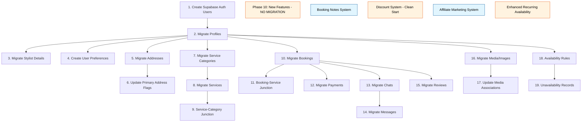

# Nabostylisten MySQL → PostgreSQL Migration: Complete Table Mapping Analysis

## Executive Summary

This document provides a comprehensive analysis of the MySQL to PostgreSQL migration, detailing exactly how each of the 26 MySQL tables maps to the 24+ PostgreSQL tables in the new Supabase schema. The migration involves fundamental architectural changes including user model consolidation, payment system simplification, and the removal of the salon business model.

## Migration Complexity Matrix

| Complexity       | Tables                                                                                        | Risk Level | Transformation Required                                |
| ---------------- | --------------------------------------------------------------------------------------------- | ---------- | ------------------------------------------------------ |
| **Critical**     | buyer, stylist, booking, payment                                                              | High       | User consolidation, status mapping, business logic     |
| **High**         | address, service, chat, message                                                               | Medium     | Polymorphic → direct relationships, JSON normalization |
| **Medium**       | category, subcategory, image, portfolio                                                       | Low-Medium | Table consolidation, file path updates                 |
| **Low**          | rating, booking_services_service                                                              | Low        | Direct field mapping                                   |
| **Not Migrated** | salon, personalchat, personal_message, chat_notes, favourite, promocode, stripe_webhook_event | N/A        | Business model changes & clean start decisions        |

## Phase 1: User System Migration

### The Most Critical and Complex Migration

### 1.1 MySQL `buyer` → PostgreSQL `profiles` (role='customer')

**Complexity**: CRITICAL  
**Dependencies**: Must be migrated FIRST - all other tables reference users

```sql
-- FIELD MAPPING
buyer.id (VARCHAR(36))                    → profiles.id (UUID)
buyer.name                                → profiles.full_name
buyer.email                               → profiles.email
buyer.phone_number                        → profiles.phone_number
buyer.bankid_verified                     → profiles.bankid_verified
buyer.stripe_customer_id                  → profiles.stripe_customer_id
buyer.created_at                          → profiles.created_at
buyer.updated_at                          → profiles.updated_at

-- FIELDS REQUIRING SPECIAL HANDLING
buyer.phone_verified                      → Supabase Auth metadata
buyer.email_verified                      → Supabase Auth metadata
buyer.last_login_at                       → Supabase Auth metadata
buyer.password                            → Supabase Auth (bcrypt → Supabase Auth)
buyer.gender                              → NOT MIGRATED (add if needed)
buyer.deleted_at                          → Filter out soft-deleted records
buyer.is_blocked                          → Supabase Auth user blocking
buyer.profile_picture_uploaded            → Check media table for avatar

-- NOTIFICATION PREFERENCES (split to separate table)
buyer.sms_enabled                         → user_preferences.sms_delivery
buyer.email_enabled                       → user_preferences.email_delivery

-- ADDRESS RELATIONSHIP CHANGE
buyer.default_address_id                  → addresses.is_primary = true
```

**Migration Process**:

1. Extract all buyers where `deleted_at IS NULL`
2. Transform VARCHAR UUIDs to PostgreSQL UUID type
3. Create Supabase Auth users with email/password
4. Insert into profiles with role='customer'
5. Create user_preferences records with notification settings
6. Update address primary flags based on default_address_id

### 1.2 MySQL `stylist` → PostgreSQL `profiles` (role='stylist') + `stylist_details`

**Complexity**: CRITICAL  
**Dependencies**: Must coordinate with buyer migration to avoid ID conflicts

```sql
-- PROFILES TABLE FIELDS
stylist.id                                → profiles.id
stylist.name                              → profiles.full_name
stylist.email                             → profiles.email
stylist.phone_number                      → profiles.phone_number
stylist.bankid_verified                   → profiles.bankid_verified
stylist.created_at                        → profiles.created_at
stylist.updated_at                        → profiles.updated_at

-- STYLIST_DETAILS TABLE FIELDS
stylist.bio                               → stylist_details.bio
stylist.can_travel                        → stylist_details.can_travel
stylist.travel_distance                   → stylist_details.travel_distance_km
stylist.instagram_profile                 → stylist_details.instagram_profile
stylist.facebook_profile                  → stylist_details.facebook_profile
stylist.twitter_profile                   → stylist_details.other_social_media_urls[]
stylist.stripe_account_id                 → stylist_details.stripe_account_id

-- FIELDS NOT MIGRATED
stylist.commission_percentage             → Business logic (not stored)
stylist.is_active                         → Use profile deletion
stylist.gender                            → Not needed
stylist.deleted_at                        → Filter out soft-deleted
stylist.salon_id                          → Salon model removed
```

**Special Considerations**:

- **ID Collision Risk**: Must ensure buyer and stylist IDs don't overlap
- **Dual Account Handling**: Some users might be both buyer AND stylist
- **Solution**: Create mapping table during migration to track old_id → new_id

### 1.3 MySQL `salon` → NOT MIGRATED

**Business Decision**: Entire salon model removed from new system
**Impact**:

- Revenue sharing simplified to platform-stylist only
- Salon owners must be converted to individual stylists
- Historical salon commission data preserved in payment records only

## Phase 2: Address & Geographic Data

### 2.1 MySQL `address` → PostgreSQL `addresses`

**Complexity**: HIGH (Polymorphic relationships + PostGIS conversion)

```sql
-- CORE FIELDS
address.id                                → addresses.id
address.created_at                        → addresses.created_at
address.updated_at                        → addresses.updated_at

-- ADDRESS DATA TRANSFORMATION
address.formatted_address                 → Parse for structured data
address.street_name + address.street_no   → addresses.street_address
address.city                              → addresses.city
address.zipcode                           → addresses.postal_code
address.country                           → addresses.country
NULL                                      → addresses.country_code (derive from country)
address.short_address + address.tag       → addresses.nickname

-- GEOGRAPHIC DATA CONVERSION (CRITICAL)
address.coordinates (MySQL POINT)         → addresses.location (PostGIS geography)
-- Requires: ST_GeogFromText('POINT(lng lat)', 4326)

-- POLYMORPHIC RELATIONSHIP RESOLUTION
IF address.buyer_id IS NOT NULL           → addresses.user_id = buyer.id
IF address.stylist_id IS NOT NULL         → addresses.user_id = stylist.id
IF address.salon_id IS NOT NULL           → NOT MIGRATED

-- NEW FIELDS
NULL                                      → addresses.entry_instructions (empty default)
DEFAULT FALSE                             → addresses.is_primary (update based on default_address_id)
```

**Geographic Conversion Script**:

```typescript
// Extract coordinates from MySQL POINT
const extractCoordinates = (
  mysqlPoint: string
): { lat: number; lng: number } => {
  // MySQL POINT format: "POINT(longitude latitude)"
  const match = mysqlPoint.match(/POINT\(([-\d.]+) ([-\d.]+)\)/);
  return {
    lng: parseFloat(match[1]),
    lat: parseFloat(match[2]),
  };
};

// Convert to PostGIS
const toPostGIS = (lng: number, lat: number): string => {
  return `POINT(${lng} ${lat})`;
};
```

## Phase 3: Service System

### 3.1 MySQL `category` + `subcategory` → PostgreSQL `service_categories`

**Complexity**: MEDIUM (Two tables → Self-referential single table)

```sql
-- TOP-LEVEL CATEGORIES
category.id                               → service_categories.id
category.name                             → service_categories.name
category.description                      → service_categories.description
NULL                                      → service_categories.parent_category_id

-- SUBCATEGORIES
subcategory.id                            → service_categories.id
subcategory.name                          → service_categories.name
subcategory.description                   → service_categories.description
subcategory.category_id                   → service_categories.parent_category_id
```

**Migration Order**:

1. Migrate all categories first (parent_category_id = NULL)
2. Migrate all subcategories with parent references
3. Validate hierarchy integrity

### 3.2 MySQL `service` → PostgreSQL `services` + `service_service_categories`

**Complexity**: HIGH (JSON field normalization required)

```sql
-- CORE SERVICE DATA
service.id                                → services.id
service.stylist_id                        → services.stylist_id
service.created_at                        → services.created_at
service.updated_at                        → services.updated_at
service.duration                          → services.duration_minutes
service.amount                            → services.price
service.currency                          → services.currency
service.is_published                      → services.is_published

-- DESCRIPTION SPLITTING (IMPORTANT)
service.description                       → Split into:
                                            - services.title (first line or up to 100 chars)
                                            - services.description (remaining content)

-- CATEGORY RELATIONSHIP
service.subcategory_id                    → service_service_categories.category_id

-- NEW FIELDS WITH DEFAULTS
DEFAULT FALSE                             → services.at_customer_place
DEFAULT TRUE                              → services.at_stylist_place
DEFAULT []                                → services.includes
DEFAULT []                                → services.requirements

-- TRIAL SESSION FIELDS (No old system support)
DEFAULT FALSE                             → services.has_trial_session
NULL                                      → services.trial_session_price
NULL                                      → services.trial_session_duration_minutes
NULL                                      → services.trial_session_description

-- NOT MIGRATED
service.deleted_at                        → Filter out soft-deleted
```

**Special JSON Handling**:
Some bookings have `service` as JSON field that needs parsing:

```typescript
// Parse booking.service JSON
const parseBookingServices = (bookingService: string): string[] => {
  try {
    const parsed = JSON.parse(bookingService);
    return Array.isArray(parsed) ? parsed : [parsed];
  } catch {
    return [];
  }
};
```

## Phase 4: Booking System

### 4.1 MySQL `booking` → PostgreSQL `bookings`

**Complexity**: CRITICAL (Status mapping + service relationships)

```sql
-- CORE BOOKING DATA
booking.id                                → bookings.id
booking.buyer_id                          → bookings.customer_id
booking.stylist_id                        → bookings.stylist_id
booking.created_at                        → bookings.created_at
booking.updated_at                        → bookings.updated_at
booking.additional_notes                  → bookings.message_to_stylist
booking.amount                            → bookings.total_price
booking.address_id                        → bookings.address_id

-- TIME CALCULATION
booking.date_time                         → bookings.start_time
booking.date_time + service.duration      → bookings.end_time
service.duration (sum if multiple)        → bookings.total_duration_minutes

-- COMPLEX STATUS MAPPING (9 → 4 statuses)
booking.status = 'payment_pending'        → 'pending'
booking.status = 'needs_confirmation'     → 'pending'
booking.status = 'confirmed'               → 'confirmed'
booking.status = 'cancelled'              → 'cancelled'
booking.status = 'completed'              → 'completed'
booking.status = 'rejected'               → 'cancelled' + cancellation_reason = 'Rejected by stylist'
booking.status = 'system_cancel'          → 'cancelled' + cancellation_reason = 'System cancellation'
booking.status = 'expired'                → 'cancelled' + cancellation_reason = 'Booking expired'
booking.status = 'failed'                 → 'cancelled' + cancellation_reason = 'Payment failed'

-- CANCELLATION TRACKING
IF status IN ('cancelled','rejected',...)  → bookings.cancelled_at = updated_at
                                           → bookings.cancellation_reason = (see above)

-- PAYMENT INTEGRATION
payment.payment_intent_id                 → bookings.stripe_payment_intent_id
NULL                                      → bookings.discount_id
0                                         → bookings.discount_applied

-- NEW TRACKING FIELDS (Automated payment processing)
NULL                                      → bookings.payment_captured_at
NULL                                      → bookings.payout_processed_at
NULL                                      → bookings.customer_receipt_email_sent_at
NULL                                      → bookings.stylist_notification_email_sent_at
NULL                                      → bookings.payout_email_sent_at

-- RESCHEDULE TRACKING (New functionality)
NULL                                      → bookings.rescheduled_from
NULL                                      → bookings.rescheduled_at
NULL                                      → bookings.reschedule_reason

-- TRIAL SESSION SUPPORT (No old system support)
DEFAULT FALSE                             → bookings.is_trial_session
NULL                                      → bookings.main_booking_id
NULL                                      → bookings.trial_booking_id

-- STRIPE CONNECT INTEGRATION
DEFAULT FALSE                             → bookings.needs_destination_update
```

### 4.2 MySQL `booking_services_service` + booking.service (JSON) → PostgreSQL `booking_services`

**Complexity**: MEDIUM (Dual source data)

```sql
-- FROM JUNCTION TABLE
booking_services_service.booking_id       → booking_services.booking_id
booking_services_service.service_id       → booking_services.service_id

-- FROM JSON FIELD (older bookings)
Parse booking.service JSON                → booking_services.service_id(s)
```

## Phase 5: Payment System

### 5.1 MySQL `payment` → PostgreSQL `payments`

**Complexity**: CRITICAL (Business logic changes)

```sql
-- CORE PAYMENT DATA
payment.id                                → payments.id
payment.payment_intent_id                 → payments.payment_intent_id
payment.created_at                        → payments.created_at
payment.updated_at                        → payments.updated_at
booking.id                                → payments.booking_id (UNIQUE constraint)

-- AMOUNT CALCULATIONS
payment.stylist_amount + platform_amount  → payments.final_amount
payment.stylist_amount + platform_amount  → payments.original_amount (no discount history)
0                                         → payments.discount_amount
payment.stylist_amount                    → payments.stylist_payout
payment.platform_amount                   → payments.platform_fee
0                                         → payments.affiliate_commission
'NOK'                                     → payments.currency

-- STRIPE TRACKING
payment.stylist_transfer_id               → payments.stylist_transfer_id
payment.platform_amount * 100             → payments.stripe_application_fee_amount (øre)

-- STATUS MAPPING
payment.status = 'pending'                → 'pending'
payment.status = 'needs_capture'          → 'requires_capture'
payment.status = 'captured'               → 'succeeded' + captured_at = updated_at
payment.status = 'cancelled'              → 'cancelled'
payment.status = 'refunded'               → 'succeeded' + refunded_amount > 0
payment.status = 'failed'                 → 'cancelled'

-- REMOVED FIELDS (Salon model)
payment.salon_amount                      → NOT MIGRATED
payment.salon_percentage                  → NOT MIGRATED
payment.salon_transfer_id                 → NOT MIGRATED

-- NEW FIELDS (Enhanced payment processing)
NULL                                      → payments.discount_code
NULL                                      → payments.discount_percentage
NULL                                      → payments.discount_fixed_amount

-- AFFILIATE SYSTEM INTEGRATION (New business model)
NULL                                      → payments.affiliate_id
NULL                                      → payments.affiliate_commission_percentage

-- ENHANCED PAYMENT LIFECYCLE TRACKING
NULL                                      → payments.authorized_at
NULL                                      → payments.succeeded_at
NULL                                      → payments.payout_initiated_at
NULL                                      → payments.payout_completed_at

-- ENHANCED REFUND TRACKING
0                                         → payments.refunded_amount
NULL                                      → payments.refund_reason
```

## Phase 6: Communication System

### 6.1 MySQL `chat` → PostgreSQL `chats`

**Complexity**: MEDIUM (Remove personal chat, booking-only)

```sql
-- CORE CHAT DATA
chat.id                                   → chats.id
chat.booking_id                           → chats.booking_id (UNIQUE)
chat.created_at                           → chats.created_at
chat.updated_at                           → chats.updated_at

-- DERIVED DATA (not stored)
chat.buyer_id                             → Derived from booking.customer_id
chat.stylist_id                           → Derived from booking.stylist_id
chat.buyer_has_unread                     → Calculate from messages
chat.stylist_has_unread                   → Calculate from messages

-- FILTER
chat.is_active                             → Only migrate active chats
```

### 6.2 MySQL `message` → PostgreSQL `chat_messages`

**Complexity**: HIGH (Sender resolution required)

```sql
-- CORE MESSAGE DATA
message.id                                → chat_messages.id
message.chat_id                           → chat_messages.chat_id
message.message                           → chat_messages.content
message.created_at                        → chat_messages.created_at
NOT message.is_unread                     → chat_messages.is_read (invert logic)

-- COMPLEX SENDER MAPPING
IF message.is_from = 'buyer':
  SELECT customer_id FROM bookings
  WHERE id = (SELECT booking_id FROM chats WHERE id = message.chat_id)
  → chat_messages.sender_id

IF message.is_from = 'stylist':
  SELECT stylist_id FROM bookings
  WHERE id = (SELECT booking_id FROM chats WHERE id = message.chat_id)
  → chat_messages.sender_id

-- IMAGE HANDLING
IF message.is_image = 1:
  Create media record with:
  - media_type = 'chat_image'
  - chat_message_id = message.id
  - file_path = message.message (contains image path)
  Update chat_messages.content = '[Image]'
```

### 6.3 MySQL `personalchat` + `personal_message` → NOT MIGRATED

**Business Decision**: All communication must be tied to bookings
**Data Loss**: Personal chat history will be lost

## Phase 7: Reviews & Ratings

### 7.1 MySQL `rating` → PostgreSQL `reviews`

**Complexity**: LOW (Direct mapping)

```sql
-- DIRECT MAPPING
rating.id                                 → reviews.id
rating.buyer_id                           → reviews.customer_id
rating.stylist_id                         → reviews.stylist_id
rating.booking_id                         → reviews.booking_id (UNIQUE)
rating.rating                             → reviews.rating
rating.review                             → reviews.comment
rating.created_at                         → reviews.created_at
```

### 7.2 MySQL `ratings` (aggregate) → NOT MIGRATED

**Decision**: Calculate aggregates at runtime with proper indexing

## Phase 8: Media Management

### 8.1 MySQL `image` → PostgreSQL `media`

**Complexity**: HIGH (Centralized media system)

```sql
-- CORE IMAGE DATA
image.id                                  → media.id
image.created_at                          → media.created_at

-- FILE PATH TRANSFORMATION
image.file_name                           → media.file_path (adjust structure)
'other'                                   → media.media_type (unless linked)
NULL                                      → media.owner_id (unless determinable)

-- ASSOCIATION DETECTION
Check service_images_image                → media.service_id
Check portfolio_image                     → media.owner_id (stylist)
Check buyer profile_picture               → media.owner_id + media_type='avatar'
Check stylist profile_picture             → media.owner_id + media_type='avatar'
```

### 8.2 MySQL `portfolio` + `portfolio_image` → PostgreSQL `media`

```sql
-- PORTFOLIO CONSOLIDATION
portfolio.stylist_id                      → media.owner_id
portfolio_image.file_name                 → media.file_path
'service_image'                           → media.media_type
portfolio_image.order = 0                 → media.is_preview_image = true
```

### 8.3 MySQL `service_images_image` → PostgreSQL `media`

```sql
service_images_image.service_id           → media.service_id
image.file_name (via image_id)            → media.file_path
'service_image'                           → media.media_type
FIRST image per service                   → media.is_preview_image = true
```

## Phase 9: Stylist Availability System

### 9.1 MySQL `stylist_availability` → PostgreSQL `stylist_availability_rules`

**Complexity**: HIGH (JSON schedule parsing)

```sql
-- PARSE JSON OPENING HOURS
stylist_availability.stylist_id           → stylist_availability_rules.stylist_id
Parse opening_hours_monday                → Create rule for 'monday'
Parse opening_hours_tuesday               → Create rule for 'tuesday'
... (for each day)

-- JSON FORMAT: {"start": "09:00", "end": "17:00"}
JSON.start                                → stylist_availability_rules.start_time
JSON.end                                  → stylist_availability_rules.end_time
```

### 9.2 MySQL `stylist_special_hours` → PostgreSQL `stylist_unavailability`

```sql
stylist_special_hours.stylist_id          → stylist_unavailability.stylist_id
stylist_special_hours.start_time          → stylist_unavailability.start_time
stylist_special_hours.end_time            → stylist_unavailability.end_time
stylist_special_hours.reason              → stylist_unavailability.reason
```

## Phase 10: New Features (No Migration Required)

### 10.1 Booking Notes System - **NEW FEATURE**

**Status**: Not migrated - entirely new functionality
**Business Impact**: Enhanced service documentation and customer relationship management

**New Tables**:
- `booking_notes` - Service documentation with categories and tagging
- Media support via `booking_note_id` in existing `media` table

**Features Added Post-Migration**:
- Comprehensive note creation with rich text content
- 6-category system (service notes, preferences, issues, results, follow-up, other)
- Smart tagging system with pre-defined tags
- Visual documentation with multi-image upload
- Duration tracking for performance analytics
- Privacy controls (customer-visible vs. private notes)

**Migration Action**: None required - stylists will start creating notes for new bookings

### 10.2 Discount System - **NO MIGRATION**

**Decision**: Do not migrate old `promocode` data - create fresh discount system
**Rationale**: Clean start with enhanced discount capabilities

**New Tables** (Not Migrated):
- `discounts` - Modern discount configuration with percentage/fixed amount
- `discount_restrictions` - User-specific access control
- `discount_usage` - Usage tracking and audit trail

**Migration Action**: Admin will create new discount codes in the new system as needed

### 10.3 Affiliate Marketing System - **NEW FEATURE**

**Status**: No MySQL equivalent - entirely new business model
**Business Impact**: New revenue sharing model for stylists

**New Tables**:
- `affiliate_applications` - Application process for affiliate status
- `affiliate_links` - Unique affiliate codes and tracking
- `affiliate_clicks` - Detailed click analytics
- `affiliate_payouts` - Commission payment tracking
- `affiliate_commissions` - Per-booking commission records

**Migration Action**: None required - new business model launches post-migration

### 10.4 Enhanced Recurring Availability - **NO MIGRATION**

**Decision**: Do not migrate old availability data - stylists will re-configure
**Rationale**: New system uses iCal RRULE standard, incompatible with old JSON format

**New Tables** (Not Migrated):
- `stylist_recurring_unavailability` - iCal-based recurring schedules
- `recurring_unavailability_exceptions` - Exception handling for recurring events

**Migration Action**: Stylists will set up their availability in the new system

## Migration Dependencies & Order

### Critical Path (Must be executed in this exact order)



## Data Validation Checkpoints

### After Each Phase

1. **Record Count Validation**

```sql
-- Example for profiles
SELECT
  (SELECT COUNT(*) FROM mysql.buyer WHERE deleted_at IS NULL) as mysql_buyers,
  (SELECT COUNT(*) FROM mysql.stylist WHERE deleted_at IS NULL) as mysql_stylists,
  (SELECT COUNT(*) FROM profiles WHERE role = 'customer') as pg_customers,
  (SELECT COUNT(*) FROM profiles WHERE role = 'stylist') as pg_stylists;
```

2. **Referential Integrity Check**

```sql
-- Check for orphaned bookings
SELECT COUNT(*) FROM bookings b
WHERE NOT EXISTS (SELECT 1 FROM profiles WHERE id = b.customer_id)
   OR NOT EXISTS (SELECT 1 FROM profiles WHERE id = b.stylist_id);
```

3. **Business Logic Validation**

```sql
-- Ensure all bookings have at least one service
SELECT COUNT(*) FROM bookings b
WHERE NOT EXISTS (
  SELECT 1 FROM booking_services WHERE booking_id = b.id
);
```

## Technical Challenges & Solutions

### 1. UUID Format Conversion

**Challenge**: MySQL uses VARCHAR(36) for UUIDs, PostgreSQL uses native UUID type

**Solution**:

```typescript
const convertUUID = (mysqlUuid: string): string => {
  // MySQL: 'xxxxxxxx-xxxx-xxxx-xxxx-xxxxxxxxxxxx'
  // PostgreSQL: Same format but as native type
  return mysqlUuid.toLowerCase(); // PostgreSQL UUIDs are lowercase
};
```

### 2. Timezone Handling

**Challenge**: MySQL datetime(6) → PostgreSQL timestamptz

**Solution**:

```typescript
const convertTimestamp = (
  mysqlDatetime: string,
  timezone: string = "Europe/Oslo"
): string => {
  // Convert MySQL datetime to ISO 8601 with timezone
  return new Date(mysqlDatetime + " " + timezone).toISOString();
};
```

### 3. Duplicate User Detection

**Challenge**: Same person might be both buyer and stylist with different IDs

**Solution**:

```sql
-- Find potential duplicates by email
WITH duplicates AS (
  SELECT email, COUNT(*) as cnt
  FROM (
    SELECT email FROM buyer WHERE deleted_at IS NULL
    UNION ALL
    SELECT email FROM stylist WHERE deleted_at IS NULL
  ) combined
  GROUP BY email
  HAVING COUNT(*) > 1
)
SELECT * FROM duplicates;
```

### 4. Handling Soft Deletes

**Decision Matrix**:

| Entity        | Soft Deleted Records | Migration Decision               |
| ------------- | -------------------- | -------------------------------- |
| Users         | deleted_at NOT NULL  | Don't migrate                    |
| Bookings      | deleted_at NOT NULL  | Migrate if completed/has payment |
| Services      | deleted_at NOT NULL  | Don't migrate                    |
| Addresses     | deleted_at NOT NULL  | Don't migrate                    |
| Chat Messages | N/A                  | Migrate all                      |

### 5. JSON Field Normalization

**Challenge**: MySQL stores complex data as JSON strings

**Solution**:

```typescript
// Parse and normalize availability JSON
const parseAvailability = (jsonString: string): AvailabilityRule[] => {
  const days = [
    "monday",
    "tuesday",
    "wednesday",
    "thursday",
    "friday",
    "saturday",
    "sunday",
  ];
  const rules = [];

  for (const day of days) {
    const dayData = JSON.parse(jsonString[`opening_hours_${day}`]);
    if (dayData && dayData.start && dayData.end) {
      rules.push({
        day_of_week: day,
        start_time: dayData.start,
        end_time: dayData.end,
      });
    }
  }
  return rules;
};
```

## Data Loss Assessment

### Data That Will Be Lost

1. **Personal Chat System** - All non-booking chats
2. **Salon Data** - Entire salon model and relationships
3. **Soft Deleted Records** - Based on business rules
4. **Historical Data**:
   - Login history
   - Detailed payment status transitions
   - Gender information
   - Twitter profiles (moved to generic social media)
5. **Computed Fields**:
   - Aggregate ratings table
   - Unread message counts

### Data That Needs Manual Review

1. **Duplicate Users** - Same email in buyer and stylist tables
2. **Orphaned Records** - References to deleted entities
3. **Invalid Enums** - Status values that don't map cleanly
4. **Incomplete Addresses** - Missing required fields
5. **Broken Media References** - Images that don't exist

## Migration Testing Strategy

### 1. Dry Run on Staging

- Use 10% sample of production data
- Verify all transformation logic
- Check for edge cases
- Measure performance

### 2. Full Test Migration

- Complete production data copy
- Run all validation queries
- Test application integration
- Load test critical paths

### 3. Rollback Testing

- Practice rollback procedure
- Verify data integrity after rollback
- Test partial rollback scenarios

## Success Metrics

### Technical Metrics

- ✅ 100% of active users migrated
- ✅ 100% of active bookings preserved
- ✅ 100% of payment records intact
- ✅ < 0.1% data validation errors
- ✅ < 5 second migration per 1000 records

### Business Metrics

- ✅ All active stylists can log in
- ✅ All future bookings preserved
- ✅ Payment history complete
- ✅ Service catalog intact
- ✅ Chat history for active bookings preserved

## Risk Mitigation

### High Risk Areas

1. **User Authentication**

   - Keep MySQL auth active for 48 hours
   - Implement fallback authentication
   - Test with subset of users first

2. **Payment Data**

   - Validate all Stripe references
   - Ensure payment intent IDs preserved
   - Test refund capabilities

3. **Geographic Data**
   - Validate all coordinate conversions
   - Test distance-based queries
   - Keep original coordinates as backup

## Post-Migration Cleanup

### Week 1

- Monitor error logs
- Fix data quality issues
- Update missing references
- Optimize slow queries

### Week 2

- Remove migration scripts
- Clean up temporary tables
- Archive MySQL dump
- Document lessons learned

### Month 1

- Decommission MySQL infrastructure
- Remove fallback code
- Update all documentation
- Plan future improvements

## Conclusion

This migration represents a fundamental architectural shift from a complex multi-tenant system to a streamlined two-sided marketplace with enhanced capabilities. The key to success lies in:

1. **Careful user consolidation** - Preventing ID collisions while preserving all relationships
2. **Accurate status mapping** - Simplifying complex states without losing business meaning
3. **Data integrity validation** - Checking at every phase to catch issues early
4. **Incremental migration** - Moving data in dependency order to maintain referential integrity
5. **Comprehensive testing** - Including edge cases, duplicates, and orphaned records
6. **Clean start approach** - Starting fresh with enhanced systems (discounts, availability) rather than migrating legacy data

**Post-Migration New Features:**
- **Booking Notes System**: Comprehensive service documentation and customer relationship management
- **Enhanced Discount System**: Modern discount management with usage tracking and restrictions
- **Affiliate Marketing System**: New revenue sharing model for stylists
- **Trial Session Support**: Enhanced service offerings with trial booking capabilities
- **Automated Payment Processing**: Reliable payment capture and payout processing

The migration will result in a cleaner, more maintainable system with improved performance, reduced complexity, and new business capabilities, setting the foundation for significant growth and feature development.
